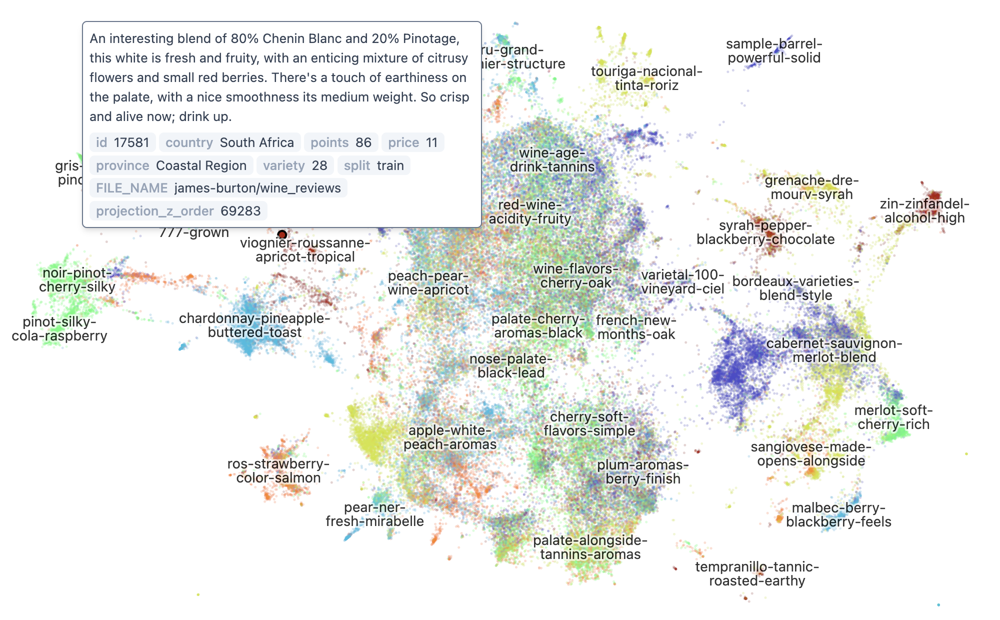
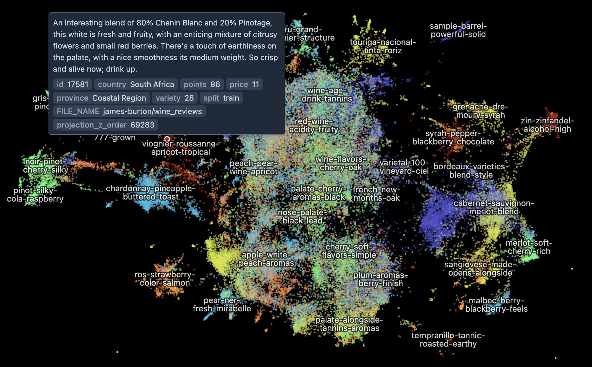

# EmbeddingView

The `embedding-atlas` package contains a component for displaying up to a few millions of points from an embedding with x and y coordinates.

We also provide React and Svelte wrappers of the component to easily include it in your own application.

<p class="light-only"></p>
<p class="dark-only"></p>

```
npm install embedding-atlas
```

To use the React wrapper:

```js
import { EmbeddingView } from "embedding-atlas/react";

// Capture the view's tooltip with a state
let [tooltip, setTooltip] = useState(null);

let xColumn: Float32Array;
let yColumn: Float32Array;
let categoryColumn: Uint8Array; // optional

<EmbeddingView
  data={{x: xColumn, y: yColumn, category: categoryColumn}}
  tooltip={tooltip}
  onTooltip={setTooltip}
  ...
/>
```

To use the Svelte wrapper:

```js
import { EmbeddingView } from "embedding-atlas/svelte";

// The tooltip as a state.
let tooltip = $state(null);

<EmbeddingView
  data={{ x: xColumn, y: yColumn, category: categoryColumn }}
  tooltip={tooltip}
  onTooltip={(v) => (tooltip = v)}
  ...
/>
```

If your application does not use React or Svelte, you may directly construct the component:

```js
import { EmbeddingView } from "embedding-atlas";

let target = document.getElementById("container");
let props = {
  data: {
    x: xColumn,
    y: yColumn,
    category: categoryColumn,
    onTooltip: (value) => {
      // ...
    },
  },
};

// Create and mount the component
let component = new EmbeddingView(target, props);

// Update with new props
component.update(newProps);

// Destroy the component
component.destroy();
```

## Properties

The view can be configured with the following properties (props):

### data `{ x: Float32Array, y: Float32Array, category?: Uint8Array }`

Required. The data to the component. `x` and `y` must be `Float32Array`, and `category`, if provided, must be `Uint8Array`.

### tooltip `DataPoint | null`

The current tooltip. The tooltip is an object with the following fields: `x`, `y`, `category`, `text`, `identifier`.

To listen for a tooltip change, use `onTooltip`.

### selection `DataPoint[] | null`

The current single or multiple point selection. Selection is triggered by clicking on the points (shift/cmd+click will toggle points). The selection is an array of objects with the following fields: `x`, `y`, `category`, `text`, `identifier`.

To listen to selection change, use `onSelection`.

### rangeSelection `Rectangle | Point[] | null`

A rectangle or a polygon (list of points) that represents the range selection.
If the value is a list of points, it is interpreted as a lasso selection
with a closed polygon with the list of points as vertices.

### categoryColors `string[] | null`

The colors for the categories. Category `i` will use the `i`-th color from this list. If not specified, default colors will be used.

### mode `"points" | "density" | null`

The rendering mode. In `points` mode, the view will simply render each data point individually. In `density` mode, the view will show a density estimation as a contour plot when zoomed out.

### width, height `number | null`

The width and height of the view.

### pixelRatio `number | null`

The pixel ratio of the view.

### colorScheme `"light" | "dark" | null`

Set light or dark mode.

### theme `Theme | null`

Configure the theme of the view. `Theme` is defined as the following:

```ts
interface ThemeConfig {
  fontFamily: string;
  clusterLabelColor: string;
  clusterLabelOutlineColor: string;
  clusterLabelOpacity: number;
  statusBar: boolean;
  statusBarTextColor: string;
  statusBarBackgroundColor: string;
  brandingLink: { text: string; href: string } | null;
}

type Theme = Partial<ThemeConfig> & {
  /** Overrides for light mode. */
  dark?: Partial<ThemeConfig>;
  /** Overrides for dark mode. */
  light?: Partial<ThemeConfig>;
};
```

### viewportState `ViewportState | null`

The viewport state. You may use this to share viewport state across multiple views. If undefined or set to `null`, the view will use a default viewport state.

To listen to viewport state change, use `onViewportState`.

`ViewportState` is defined as the following:

```ts
interface ViewportState {
  /** The x coordinate of the center of the viewport in data units. */
  x: number;
  /** The y coordinate of the center of the viewport in data units. */
  y: number;
  /** The scale of the viewport. This scales data units to [-1, 1]. */
  scale: number;
}
```

### automaticLabels `boolean | null`

Set to `true` to enable automatic labels from the `text` column.

### onViewportState `((value: ViewportState) => void) | null`

A callback for when viewportState changes.

### onTooltip `((value: DataPoint | null) => void) | null`

A callback for when tooltip changes.

### onSelection `((value: DataPoint[] | null) => void) | null`

A callback for when selection changes.

### onRangeSelection `((value: Rectangle | Point[] | null) => void) | null`

A callback for when rangeSelection changes.

### querySelection `Function | null`

An async function of type `(x: number, y: number, unitDistance: number) => Promise<DataPoint | null>`,
that returns a data point near the given (x, y) location. The `unitDistance` parameter is the distance
of a single pixel in data domain. You can use this to determine the distance threshold for selecting a point.

### queryClusterLabels `Function | null`

An async function of type `(rects: Rectangle[]) => Promise<string | null>`, that returns a cluster label
for the points covered by the given set of rectangles.

## Custom Tooltip

You may use the `customTooltip` property to change how tooltips are displayed.

First create a class for the custom tooltip component:

```js
class CustomTooltip {
  constructor(target, props) {
    // Create the tooltip component and mount it to the target element.
    // props will contain a `tooltip` field, plus any custom prop you specified.
  }
  update(props) {
    // Update the component with new props.
  }
  destroy() {
    // Destroy the component.
  }
}
```

Then specify the `customTooltip` property to the component:

```js
<EmbeddingView
  ...
  customTooltip={{
    class: CustomTooltip,
    props: { customProp: 10 } // Pass additional props to the tooltip component.
  }}
/>
```

## Custom Overlay

You may use the `customOverlay` property to add an overlay to the embedding view.

First create a class for the custom overlay:

```js
class CustomOverlay {
  constructor(target, props) {
    // Create the tooltip component and mount it to the target element.
    // props will contain a `proxy` field, plus any custom prop you specified.
    // You can use proxy.location(x, y) to get the pixel location of a data point at (x, y).
  }
  update(props) {
    // Update the component with new props.
  }
  destroy() {
    // Destroy the component.
  }
}
```

Then specify the `customOverlay` property to the component:

```js
<EmbeddingView
  ...
  customOverlay={{
    class: CustomOverlay,
    props: { customProp: 10 } // Pass additional props to the overlay component.
  }}
/>
```
