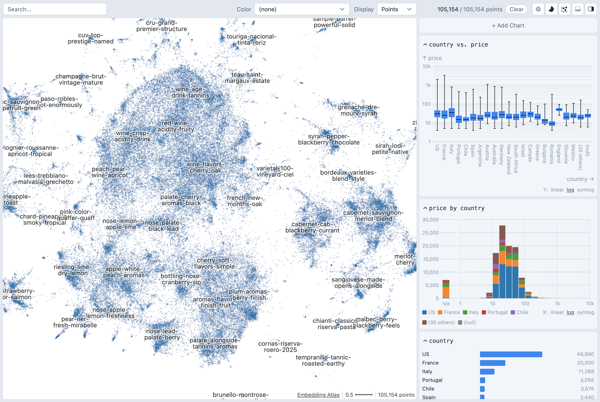
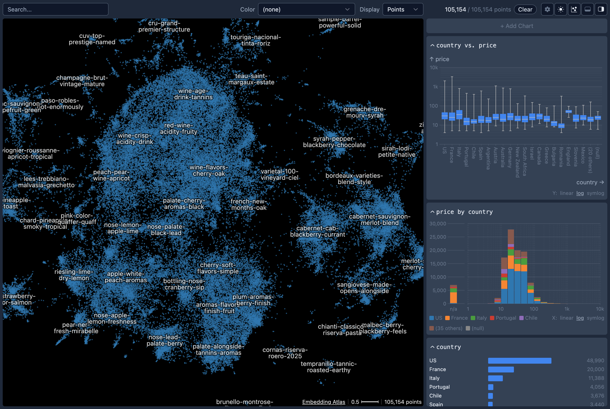

# Command Line Utility

The Python package contains a command-line utility for you to quickly explore large text datasets with metadata.




## Installation

```bash
pip install embedding-atlas
```

and then launch the command line tool:

```bash
embedding-atlas [OPTIONS] INPUTS...
```

::: tip
To avoid package installation issues, we recommend using the [uv package manager](https://docs.astral.sh/uv/) to install Embedding Atlas and its dependencies. uv allows you to launch the command line tool with a single command:

```bash
uvx embedding-atlas
```

On Windows, you may install the package on either the [Windows Subsystem for Linux (WSL)](https://learn.microsoft.com/en-us/windows/wsl/install) or directly on Windows. To use NVIDIA GPUs, you'll need to install a PyTorch version that supports CUDA, see [here](https://pytorch.org/get-started/locally/) for more details.
:::

## Loading Data

You can load your data in two ways: locally or from Hugging Face.

### Loading Local Data

To get started with your own data, run:

```bash
embedding-atlas path_to_dataset.parquet
```

### Loading Hugging Face Data

You can instead load datasets from Hugging Face:

```bash
embedding-atlas huggingface_org/dataset_name
```

## Visualizing Embeddings

The script will use [SentenceTransformers](https://sbert.net/) to compute embedding vectors for the specified column containing the text data. The script will then project the high-dimensional embedding vectors to 2D with [UMAP](https://umap-learn.readthedocs.io/en/latest/index.html).

::: tip
Optionally, if you know what column your text data is in beforehand, you can specify which column to use with the `--text` flag, for example:

```bash
embedding-atlas path_to_dataset.parquet --text text_column
```

Similarly, you may supply the `--image` flag for image data, or the `--vector` flag for pre-computed embedding vectors.
:::

If you've already pre-computed the embedding projection (e.g., by running your own embedding model and projecting them with UMAP), you may store them as two columns such as `projection_x` and `projection_y`, and pass them into `embedding-atlas` with the `--x` and `--y` flags:

```bash
embedding-atlas path_to_dataset.parquet --x projection_x --y projection_y
```

You may also pass in the `--neighbors` flag to specify the column name for pre-computed nearest neighbors.
The `neighbors` column should have values in the following format: `{"ids": [id1, id2, ...], "distances": [d1, d2, ...]}`.
The IDs should be zero-based row indices.
If this column is specified, you'll be able to see nearest neighbors for a selected point in the tool.

Once this script completes, it will print out a URL like `http://localhost:5055/`. Open the URL in a web browser to view the embedding.

## Usage

```
Usage: embedding-atlas [OPTIONS] INPUTS...

Options:
  --text TEXT                     Column containing text data.
  --image TEXT                    Column containing image data.
  --vector TEXT                   Column containing pre-computed vector
                                  embeddings.
  --split TEXT                    Dataset split name(s) to load from Hugging
                                  Face datasets. Can be specified multiple
                                  times for multiple splits.
  --enable-projection / --disable-projection
                                  Compute embedding projections from
                                  text/image/vector data. If disabled without
                                  pre-computed projections, the embedding view
                                  will be unavailable.
  --model TEXT                    Model name for generating embeddings (e.g.,
                                  'all-MiniLM-L6-v2').
  --trust-remote-code             Allow execution of remote code when loading
                                  models from Hugging Face Hub.
  --x TEXT                        Column containing pre-computed X coordinates
                                  for the embedding view.
  --y TEXT                        Column containing pre-computed Y coordinates
                                  for the embedding view.
  --neighbors TEXT                Column containing pre-computed nearest
                                  neighbors in format: {"ids": [n1, n2, ...],
                                  "distances": [d1, d2, ...]}. IDs should be
                                  zero-based row indices.
  --sample INTEGER                Number of random samples to draw from the
                                  dataset. Useful for large datasets.
  --umap-n-neighbors INTEGER      Number of neighbors to consider for UMAP
                                  dimensionality reduction (default: 15).
  --umap-min-dist FLOAT           The min_dist parameter for UMAP.
  --umap-metric TEXT              Distance metric for UMAP computation
                                  (default: 'cosine').
  --umap-random-state INTEGER     Random seed for reproducible UMAP results.
  --duckdb TEXT                   DuckDB connection mode: 'wasm' (run in
                                  browser), 'server' (run on this server), or
                                  URI (e.g., 'ws://localhost:3000').
  --host TEXT                     Host address for the web server (default:
                                  localhost).
  --port INTEGER                  Port number for the web server (default:
                                  5055).
  --auto-port / --no-auto-port    Automatically find an available port if the
                                  specified port is in use.
  --static TEXT                   Custom path to frontend static files
                                  directory.
  --export-application TEXT       Export the visualization as a standalone web
                                  application to the specified ZIP file and
                                  exit.
  --version                       Show the version and exit.
  --help                          Show this message and exit.
```
